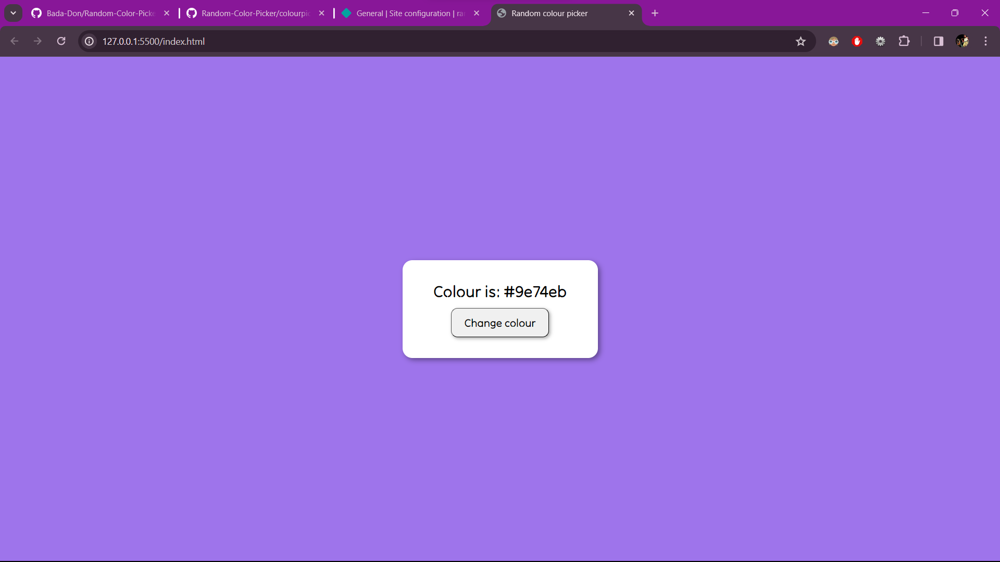

# Random-Color-Picker
# Random Color Picker

## Overview

Welcome to the Random Color Picker project! This simple web application generates random colors and provides you with their HEX, RGB, and HSL values. It's a fun tool for designers, developers, or anyone looking for creative inspiration.

## Features

- **Generate Random Colors**: Click a button to get a new, random color.
- **Color Information**: View the HEX value of each generated color.
- **Copy to Clipboard**: Easily copy the color values to use in your projects.
- **Visual Appeal**: Enjoy a visually pleasing interface with vibrant colors.

## Technologies Used

- **Frontend**: HTML, CSS, JavaScript
- **Hosting**: Netlify

## Try It Out

[Click here to experience the Random Color Picker](https://randomcolorpick.netlify.app/)

## How to Run Locally

If you want to run this project locally, follow these steps:

1. Clone the repository: `git clone [https://github.com/Bada-Don/Random-Color-Picker]`
2. Navigate to the project folder: `cd random-color-picker`
3. Open the `index.html` file in your web browser.

Feel free to contribute, provide feedback, or report any issues. Happy color picking!

---

